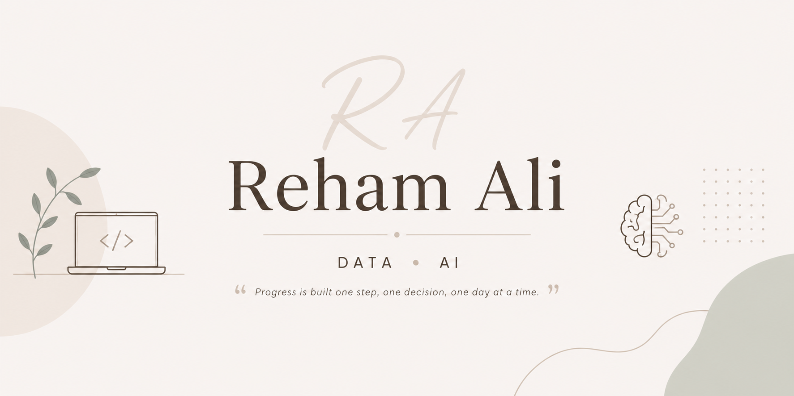

  

 

# Hi, I'm Reham Ali 👩‍💻  
🎓 Intelligent Systems Engineering Student | Data & AI Enthusiast  

---

## 🚀 About Me

- 🎓 Engineering student at **Helwan National University (2023–Present)**
- 📊 Passionate about **Data Analysis, Machine Learning, and AI Systems**
- 🤖 Interested in **Embedded Systems & Smart Applications**
- 💡 I enjoy turning raw data into insights and building real-world intelligent systems
- 💬 Ask me about **Data Analysis, Python, SQL**

---

## 🛠️ Tech Stack

### 📊 Data & AI
- Python (Pandas, NumPy)
- Machine Learning
- Data Analysis & EDA
- Power BI, Tableau
- Matplotlib, Seaborn

### 💻 Programming
- Python | SQL | C | C++ | Java

### 🗄️ Databases
- SQL Server
- Database Design (ERD, Normalization, Query Optimization)

### ⚡ Embedded Systems
- ATmega32 | Arduino | ESP32  
- PWM | Motor Control (L293D, L298N)  
- Interrupts | PCB & SMT  

### 🔌 Electronics
- Logic Gates  
- Circuit Design (Proteus)

---

## 📌 Featured Projects

### 🧠 Multimodal Fight Detection System
- Combined **DSP + Deep Learning (LRCN: MobileNetV2 + LSTM)**
- Achieved **~94% validation accuracy**
- Real-time alerts using Arduino + GUI

---

### 🏥 Hospital Management System (Database Design)
- Designed full **ERD + relational schema**
- Implemented using **SQL Server**
- Includes optimization & stored procedures

---

### 📊 Sales Performance Dashboard
- Built using **Excel + Power BI**
- Power Query → Power Pivot pipeline  
- Interactive KPIs & business insights

---

### 🎯 Student Recommendation System (AI)
- AI-based course recommendation engine
- Uses ranking algorithm + preference analysis

---

### 🚗 Smart Cooling Car (Embedded)
- ESP32-based system with **PWM motor control**
- Real-time remote operation
- Integrated cooling mechanism

---

### 🔢 IR Object Counter & Digital Systems
- IR Counter (LM358 + CD4026 + 7-Segment)
- Digital Lock (JK Flip-Flops)
- Line Following Robot

---

## 🌐 Connect With Me

- 💼 LinkedIn: https://linkedin.com/in/reham-ali-salah-a69691330  

  
---

## ✨ Goals

- 🚀 Land a strong internship in **Data / AI / Embedded Systems / Full Stack**
- 📚 Keep building real-world impactful projects
- 💪 Become a top-tier engineer with a strong technical profile

---

⭐ *"Consistency beats motivation — I show up even when I don’t feel like it."*
